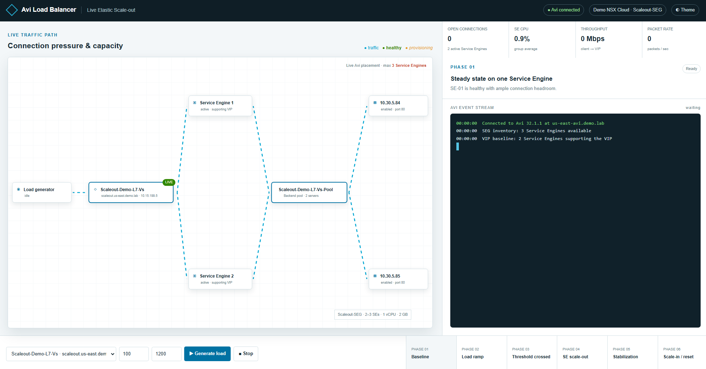

# Avi Live Elastic Scale-out Demo



This project provides a live demonstration of Avi Load Balancer Virtual Service scale-out and scale-in. It is not a simulation. The application discovers Virtual Services in a configured Avi cloud and Service Engine Group, reads live analytics and placement data, generates sustained TCP connections against the selected VIP, and displays topology and phase changes in a presenter-friendly web interface.

## Safety

Use this application only against a lab Virtual Service that you are authorized to test. The generator creates real network connections. It is capped at 400 new connections per second and 1,500 held connections, but lower demonstration values are strongly recommended.

## Requirements

- Node.js 18 or newer
- Network and DNS access from the application host to the Avi Controller
- Network access from the application host to the selected Virtual Service
- An Avi account with permission to read analytics, placement, Service Engines, pools, and Virtual Services
- Permission to request Virtual Service scale-in if accelerated Phase 6 reset is used

The project has no external npm dependencies.

## Configuration

| Variable | Default | Description |
| --- | --- | --- |
| `PORT` | `8080` | Web server listening port |
| `AVI_CONTROLLER` | `us-east-avi.demo.lab` | Avi Controller hostname |
| `AVI_USERNAME` | `admin` | Avi username |
| `AVI_PASSWORD` | None | Avi password, required |
| `AVI_API_VERSION` | `32.1.1` | Avi API version header |
| `AVI_CLOUD` | `Demo NSX Cloud` | Avi cloud name |
| `AVI_SE_GROUP` | `Scaleout-SEG` | Service Engine Group name |
| `AVI_TLS_VERIFY` | `false` | Set to `true` when the controller certificate is trusted |
| `AUTO_RESET_SECONDS` | `30` | Stabilization time before load is released |
| `SCALEIN_QUIET_SECONDS` | `90` | Quiet period before scale-in, minimum 30 seconds |

## Local run

PowerShell:

```powershell
$env:AVI_PASSWORD = Read-Host "Avi admin password" -MaskInput
$env:PORT = "8080"
npm start
```

Linux:

```bash
export AVI_PASSWORD='replace-with-password'
export PORT=8080
npm start
```

Open `http://localhost:8080`, replacing the port if `PORT` was changed.

## CentOS Stream 9 installation

```bash
sudo dnf module install -y nodejs:20
sudo git clone YOUR_REPOSITORY_URL /opt/avi-scaleout-demo
cd /opt/avi-scaleout-demo
sudo npm install --omit=dev
sudo cp deploy/avi-scaleout-demo.env.example /etc/avi-scaleout-demo.env
sudo chmod 600 /etc/avi-scaleout-demo.env
sudo cp deploy/avi-scaleout-demo.service /etc/systemd/system/avi-scaleout-demo.service
sudo vi /etc/avi-scaleout-demo.env
sudo systemctl daemon-reload
sudo systemctl enable --now avi-scaleout-demo
sudo systemctl status avi-scaleout-demo
```

Set the real password and confirm the controller, cloud, Service Engine Group, and port in `/etc/avi-scaleout-demo.env` before starting the service.

If firewalld is enabled, open the configured port. This example uses port 5480:

```bash
sudo firewall-cmd --permanent --add-port=5480/tcp
sudo firewall-cmd --reload
```

Open `http://SERVER_NAME:5480` in a browser.

## Changing the listening port

Edit `/etc/avi-scaleout-demo.env` and change `PORT`:

```text
PORT=5480
```

Restart the service and update the firewall or reverse proxy:

```bash
sudo systemctl restart avi-scaleout-demo
```

## Presenter workflow

1. Select a discovered Virtual Service.
2. Set a conservative connections-per-second rate and maximum held connections.
3. Select `Generate load`.
4. Watch live connections, throughput, packet rate, placement, and Service Engine count.
5. Wait for Avi to attach an additional Service Engine to the VIP.
6. Allow the automatic reset or select `Stop` to close all generated connections.
7. Watch Avi return the VIP to its baseline Service Engine placement.

The event stream distinguishes the total SEG inventory from the Service Engines supporting the selected VIP. Scale-out and scale-in are reported only after live placement telemetry confirms the change.

## Troubleshooting

Check application health:

```bash
curl -s http://127.0.0.1:5480/api/health
```

Confirm timer configuration:

```bash
curl -s http://127.0.0.1:5480/api/avi/discover | jq '.demo'
```

View service logs:

```bash
sudo journalctl -u avi-scaleout-demo -f
```

View background-only scale-in diagnostics:

```bash
sudo journalctl -u avi-scaleout-demo -f | grep --line-buffered '\[scale-in\]'
```

If Virtual Services do not load, verify that the application host can resolve and reach the controller and that `AVI_PASSWORD` is present in the environment file.

## Repository contents

- `server.js`: Node.js web server, Avi API integration, and connection generator
- `public/`: Frontend HTML, JavaScript, and styles
- `deploy/`: CentOS environment and systemd templates
- `config.example.json`: Reference configuration without credentials
- `package.json`: Node.js package metadata and scripts

